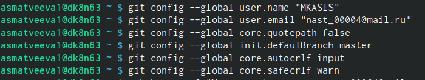
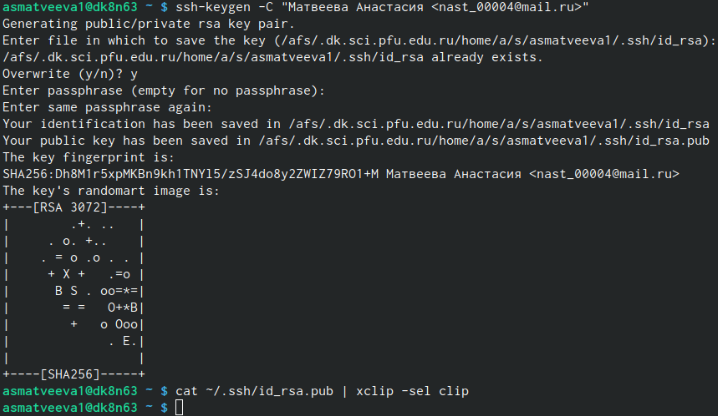
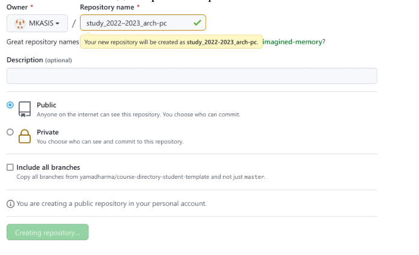
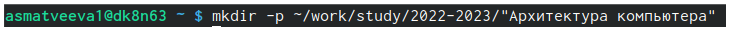
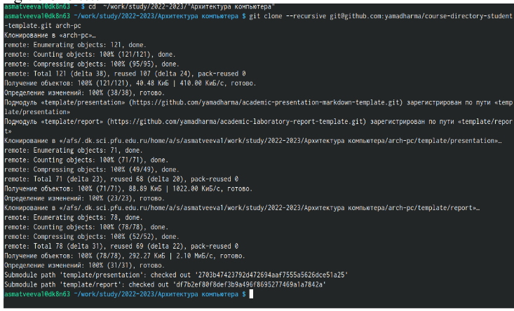
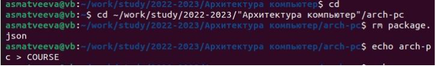
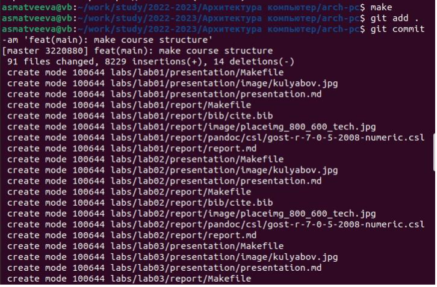
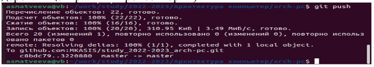

---
## Front matter
title: "Отчёта по лабораторной работе №2"
subtitle: "Арихитектура вычеслительных систем "
author: "Матвеева Анастасия Сергеевна"

## Generic otions
lang: ru-RU
toc-title: "Содержание"

## Bibliography
bibliography: bib/cite.bib
csl: pandoc/csl/gost-r-7-0-5-2008-numeric.csl

## Pdf output format
toc: true # Table of contents
toc-depth: 2
lof: true # List of figures
lot: true # List of tables
fontsize: 12pt
linestretch: 1.5
papersize: a4
documentclass: scrreprt
## I18n polyglossia
polyglossia-lang:
name: russian
options:
- spelling=modern
- babelshorthands=true
polyglossia-otherlangs:
name: english
## I18n babel
babel-lang: russian
babel-otherlangs: english
## Fonts
mainfont: PT Serif
romanfont: PT Serif
sansfont: PT Sans
monofont: PT Mono
mainfontoptions: Ligatures=TeX
romanfontoptions: Ligatures=TeX
sansfontoptions: Ligatures=TeX,Scale=MatchLowercase
monofontoptions: Scale=MatchLowercase,Scale=0.9
## Biblatex
biblatex: true
biblio-style: "gost-numeric"
biblatexoptions:
- parentracker=true
- backend=biber
- hyperref=auto
- language=auto
- autolang=other*
- citestyle=gost-numeric
## Pandoc-crossref LaTeX customization
figureTitle: "Рис."
tableTitle: "Таблица"
listingTitle: "Листинг"
lofTitle: "Список иллюстраций"
lotTitle: "Список таблиц"
lolTitle: "Листинги"
## Misc options
indent: true
header-includes:
- \usepackage{indentfirst}
- \usepackage{float} # keep figures where there are in the text
- \floatplacement{figure}{H} # keep figures where there are in the text
---

# Цель работы

Целью работы является изучить идеологию и
применение средств контроля версий. Приобрести практические
навыки по работе с системой git.
# Задание
1. Создайте отчет по выполнению лабораторной работы в соответствующем
каталоге рабочего пространства (labs>lab03>report).
2. Скопируйте отчеты по выполнению предыдущих лабораторных работ в
соответствующие каталоги созданного рабочего пространства.
3. Загрузите файлы на github.

# Выполнение лабораторной работы
1. Откройте терминал
2. Вводим команды указав name и mail.
  Настраивем utf-8. Задаем имя начальной ветки.
  Параметр autocrlf. 
  Параметр safecrlf.
  
{ #fig:001 width=90% }

3. Создаем ключ

{ #fig:002 width=90% } 

4. Копируем с помощью команды "cat".

{ #fig:003 width=90% }

5. Создаем каталог предмета "Архитектура компьютера"

{ #fig:004 width=90% }

6. Создаем репозиторий 

{ #fig:005 width=90% }

7. Переходим в каталог курса

{ #fig:006 width=90% }

8. Клонируем репозиторий 

{ #fig:007 width=90% }

9. Каталог курса.
удаляем лишние файлы 
Пишем "echo"

{ #fig:008 width=90% }

10. Make 
Git add .
Git-commit 

{ #fig:009 width=90% }

11. Git push (отправка всез произведенных изменений локального дерево)

{ #fig:010 width=90% }

# Выводы
Мы научились работать в GitHub и приобрели навыки использования.

# Список литературы{.unnumbered}

::: {#refs}
:::

