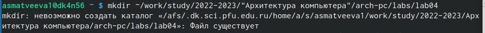
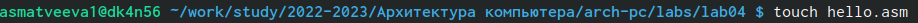
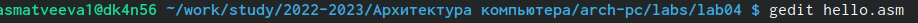
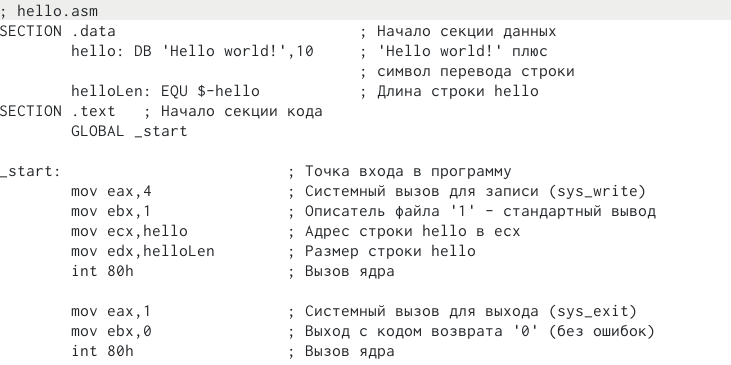
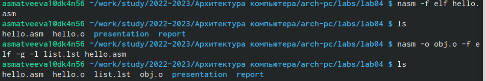
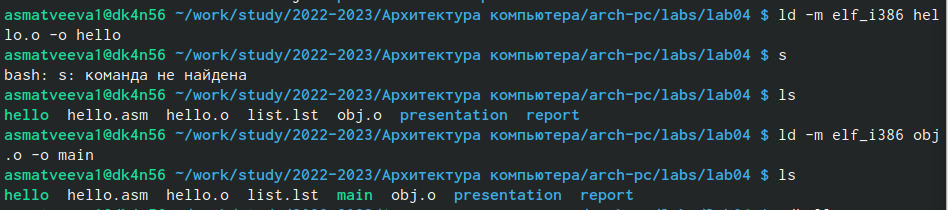
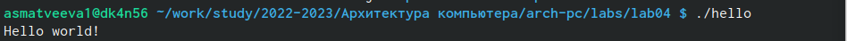
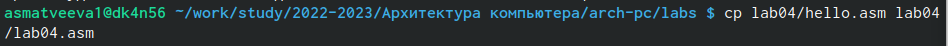
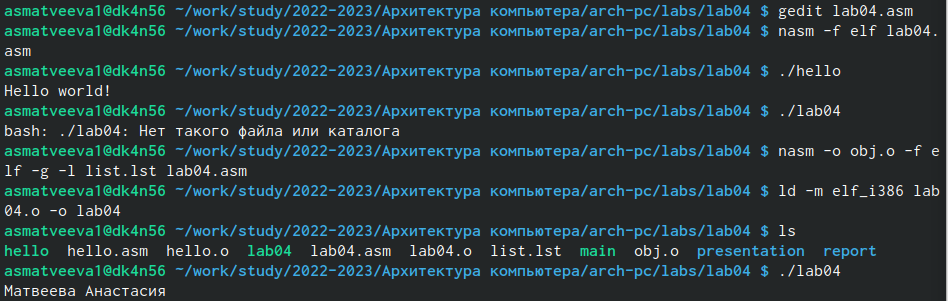

---
## Front matter
title: "Отчет Лабораторная работа No4. Создание и
процесс обработки программ на языке
ассемблера NASM"
subtitle: "Простейший вариант"
author: "Матвеева Анастасия Сергеевна"

## Generic otions
lang: ru-RU
toc-title: "Содержание"

## Bibliography
bibliography: bib/cite.bib
csl: pandoc/csl/gost-r-7-0-5-2008-numeric.csl

## Pdf output format
toc: true # Table of contents
toc-depth: 2
lof: true # List of figures
lot: true # List of tables
fontsize: 12pt
linestretch: 1.5
papersize: a4
documentclass: scrreprt
## I18n polyglossia
polyglossia-lang:
  name: russian
  options:
	- spelling=modern
	- babelshorthands=true
polyglossia-otherlangs:
  name: english
## I18n babel
babel-lang: russian
babel-otherlangs: english
## Fonts
mainfont: PT Serif
romanfont: PT Serif
sansfont: PT Sans
monofont: PT Mono
mainfontoptions: Ligatures=TeX
romanfontoptions: Ligatures=TeX
sansfontoptions: Ligatures=TeX,Scale=MatchLowercase
monofontoptions: Scale=MatchLowercase,Scale=0.9
## Biblatex
biblatex: true
biblio-style: "gost-numeric"
biblatexoptions:
  - parentracker=true
  - backend=biber
  - hyperref=auto
  - language=auto
  - autolang=other*
  - citestyle=gost-numeric
## Pandoc-crossref LaTeX customization
figureTitle: "Рис."
tableTitle: "Таблица"
listingTitle: "Листинг"
lofTitle: "Список иллюстраций"
lotTitle: "Список таблиц"
lolTitle: "Листинги"
## Misc options
indent: true
header-includes:
  - \usepackage{indentfirst}
  - \usepackage{float} # keep figures where there are in the text
  - \floatplacement{figure}{H} # keep figures where there are in the text
---

# Цель работы

Освоение процедуры компиляции и сборки программ, написанных на ассем-
блере NASM.

# Задание

1. В каталоге ~/work/arch-pc/lab05 с помощью команды cp создайте копию
файла hello.asm с именем lab5.asm
2. С помощью любого текстового редактора внесите изменения в текст про-
граммы в файле lab5.asm так, чтобы вместо Hello world! на экран выво-
дилась строка с вашими фамилией и именем.
3. Оттранслируйте полученный текст программы lab5.asm в объектный
файл. Выполните компоновку объектного файла и запустите получивший-
ся исполняемый файл.
4. Скопируйте файлы hello.asm и lab5.asm в Ваш локальный репозиторий
в каталог ~/work/study/2022-2023/"Архитектура компьютера"/arch-
pc/labs/lab05/. Загрузите файлы на Github.

# Ход работы
Лаборатовная работа 
1. Создаем каталог для работы с ассемблер NASM.

{#fig:001 width=90%}

2. Переходим в каталог.

{#fig:002 width=90%}

3. Создаем текстовый файл с именеи Hello.sam

{#fig:003 width=90%}

4. Открываем созданый файл и вводим данный нам текст 

{#fig:004 width=90%}
{#fig:006 width=90%}

5. Превращаем текст программы в объектный код. Проверяем(ls). Компилируем исходный файл. Проверяем.
 
 {#fig:007 width=90%}
 
6. Передаем на обработку компоновщику. Проверяем. Ставим имя файлу.

{#fig:008 width=90%}

7. Запускаем программу. 

{#fig:009 width=90%}
 Самомстоятельная работа 
 
 1. Создаем копию.
 
 {#fig:010 width=90%}
 
 2. Редактруем изминения в текстовом редакторе (gedit). Запускаем программу.
 
 {#fig:0011 width=90%}
 
 3. Загружаем в репозиторий. 
 

# Выводы

Мы обучились работать, компилировать и собирать программы написанные на ассмблере NASM. 

# Список литературы{.unnumbered}

::: {#refs}
:::
